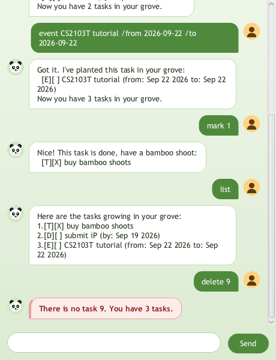

# Wei the Panda User Guide



Wei the Panda is a friendly chatbot that keeps track of your tasks. You type a
short command, and Wei adds, finds, sorts or ticks off tasks in your
"task grove". Everything is saved automatically, so your tasks are still there
the next time you open the app.

## Quick start

1. Make sure you have **Java 25** installed. You can check with `java -version`.
1. Download `zhangwei.jar` from the latest release.
1. Put it in an empty folder, open a terminal in that folder, and run:

   ```text
   java -jar zhangwei.jar
   ```

1. Type a command in the box at the bottom and press Enter or click **Send**.

Your tasks are saved in `data/zhangwei.txt`, inside the folder you ran the
command from.

## Notes about the command format

* Command words are lower case: `list` works, `LIST` does not.
* Words in `UPPER_CASE` are what you fill in, e.g. in `todo DESCRIPTION`,
  `DESCRIPTION` could be `read book`.
* Dates use the `yyyy-MM-dd` format, e.g. `2026-09-19`. Wei shows them as
  `Sep 19 2026`.
* `TASK_NUMBER` is the number shown beside the task in `list`.
* A task description cannot contain the `|` character.

## Adding a todo: `todo`

Adds a task with no date.

Format: `todo DESCRIPTION`

Example: `todo buy bamboo shoots`

```text
Got it. I've planted this task in your grove:
  [T][ ] buy bamboo shoots
Now you have 1 task in your grove.
```

## Adding a deadline: `deadline`

Adds a task that must be done by a date.

Format: `deadline DESCRIPTION /by DATE`

Example: `deadline submit iP /by 2026-09-19`

```text
Got it. I've planted this task in your grove:
  [D][ ] submit iP (by: Sep 19 2026)
Now you have 2 tasks in your grove.
```

## Adding an event: `event`

Adds a task that runs from one date to another. `/from` must come before
`/to`, and the event cannot end before it starts.

Format: `event DESCRIPTION /from DATE /to DATE`

Example: `event CS2103T tutorial /from 2026-09-22 /to 2026-09-22`

```text
Got it. I've planted this task in your grove:
  [E][ ] CS2103T tutorial (from: Sep 22 2026 to: Sep 22 2026)
Now you have 3 tasks in your grove.
```

## Listing all tasks: `list`

Shows every task, numbered from 1. `[X]` means the task is done.

Format: `list`

```text
Here are the tasks growing in your grove:
1.[T][ ] buy bamboo shoots
2.[D][ ] submit iP (by: Sep 19 2026)
3.[E][ ] CS2103T tutorial (from: Sep 22 2026 to: Sep 22 2026)
```

## Marking a task as done: `mark`

Format: `mark TASK_NUMBER`

Example: `mark 1`

```text
Nice! This task is done, have a bamboo shoot:
  [T][X] buy bamboo shoots
```

## Marking a task as not done: `unmark`

Format: `unmark TASK_NUMBER`

Example: `unmark 1`

```text
OK, no rush. This task is not done yet:
  [T][ ] buy bamboo shoots
```

## Deleting a task: `delete`

Removes a task. The tasks after it move up by one number.

Format: `delete TASK_NUMBER`

Example: `delete 1`

```text
Noted. I've chewed this task away:
  [T][ ] buy bamboo shoots
Now you have 2 tasks in your grove.
```

## Finding tasks: `find`

Shows the tasks whose description contains the given words. Upper and lower
case are treated the same, so `find IP` also finds `submit iP`.

Format: `find KEYWORD`

Example: `find ip`

```text
Here are the matching tasks I found in your grove:
1.[D][ ] submit iP (by: Sep 19 2026)
```

## Sorting tasks: `sort`

Puts the list in a new order and keeps it that way, so the task numbers change
to match.

Format: `sort CRITERION`, where `CRITERION` is one of:

* `date`: earliest first. Todos have no date, so they go last.
* `description`: A to Z.
* `status`: tasks not done first, then done tasks.

Example: `sort date`

```text
Sorted your tasks by date, neat as a row of bamboo.
Here are the tasks growing in your grove:
1.[D][ ] submit iP (by: Sep 19 2026)
2.[E][ ] CS2103T tutorial (from: Sep 22 2026 to: Sep 22 2026)
```

## Exiting: `bye`

Says goodbye and closes the window.

Format: `bye`

```text
Bye. Time for my bamboo nap. Come back soon!
```

## Saving your data

Wei saves your tasks after every change, so there is no save command. If the
save file is damaged, Wei loads what it can, tells you, and keeps a copy of the
original file as `data/zhangwei.txt.corrupt`.

## Command summary

| Command | Format |
| --- | --- |
| Todo | `todo DESCRIPTION` |
| Deadline | `deadline DESCRIPTION /by DATE` |
| Event | `event DESCRIPTION /from DATE /to DATE` |
| List | `list` |
| Mark | `mark TASK_NUMBER` |
| Unmark | `unmark TASK_NUMBER` |
| Delete | `delete TASK_NUMBER` |
| Find | `find KEYWORD` |
| Sort | `sort date`, `sort description` or `sort status` |
| Exit | `bye` |
